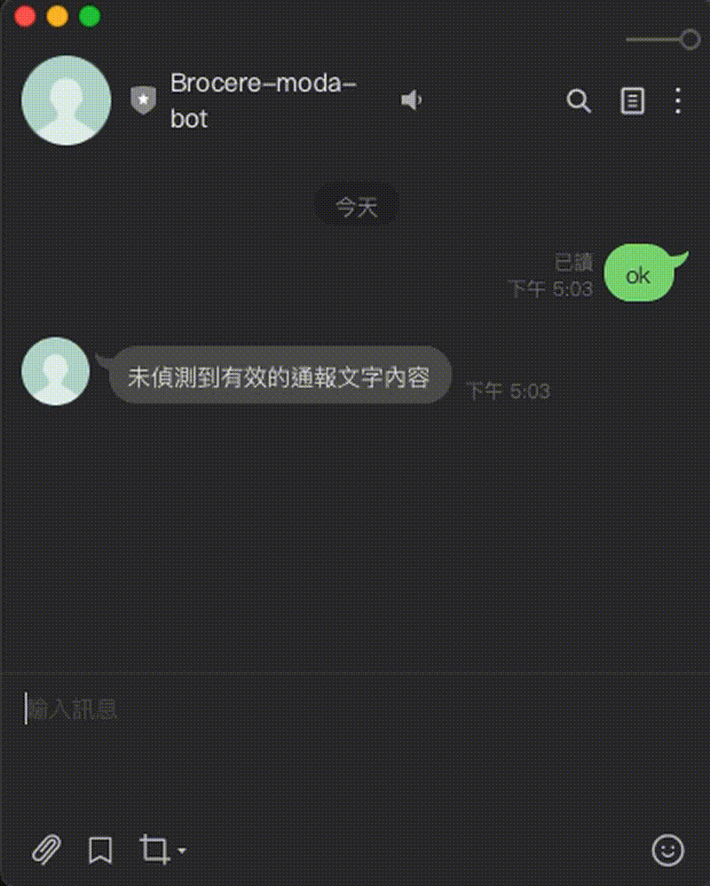

# 衛星多模態模組化情報中樞與智慧代理人分析元件

### 數位發展部「防災積木元件創新賽：公民科技拼出韌性臺灣」參賽作品
### 參賽團隊：博誠魔塊：韌性積木災防隊
### 實作型態：應用程式介面服務型 / 模組上下文協定伺服器元件

---

💡 **大會審查特別說明：**
本作品由「博誠魔塊：韌性積木災防隊」開發，完全符合大會規範。免安裝任何後端伺服器環境，全功能以開源純前端模擬應用程式介面與資料流程呈現。評審與開源社群只需雙擊網頁檔案或點擊下方展示連結，即可一鍵驗證四大模組通報（實作一）與人工智慧代理人多步驟推理分析（實作二）的完整輸入、處理、輸出規格。

### 🌐 核心功能線上互動式原型驗證（網頁展示）
* **實作一：多模態應用程式介面服務元件通報中樞** ➔ [點此開啟線上驗證](https://brocere-iot.github.io/moda-competition/call.html)
* **實作二：人工智慧代理人元件分析大腦** ➔ [點此開啟線上驗證](https://brocere-iot.github.io/moda-competition/analysis.html)

---

## 目錄

- [專案說明](#專案說明)
  - [一、問題描述](#一-問題描述)
    - [1. 觀察到的實際防災問題與現行痛點](#1-觀察到的實際防災問題與現行痛點)
    - [2. 人物角色設定](#2-人物角色設定)
    - [3. 本作品如何提供協助](#3-本作品如何提供協助)
  - [二、解法構想](#二-解法構想)
  - [三、元件設計與標準化資料交換規格（大會要求一）](#三-元件設計與標準化資料交換規格大會要求一)
  - [四、真實防災資料鏈結與技術運作方式（大會要求二）](#四-真實防災資料鏈結與技術運作方式大會要求二)
  - [五、人工智慧技術架構與風險治理（大會要求三）](#五-人工智慧技術架構與風險治理大會要求三)
  - [六、生成式 AI 工具使用宣告（大會要求四）](#六-設計與開發過程之生成式人工智慧工具使用宣告大會要求四)
  - [七、使用情境假設](#七-使用情境假設)
  - [八、預期效益與開源公民科技串接](#八-預期效益與開源公民科技串接)
  - [九、延伸潛力與未來產業格局](#九-延伸潛力與未來產業格局)
- [技術實作說明](#技術實作說明)
  - [Prerequisites](#prerequisites)
  - [Option 1：本地開發](#option-1-local-development-without-container)
  - [Option 2：Docker 容器](#option-2-production-setup-using-docker-container)
  - [Extensions：LINE Webhook + ngrok](#extensions-line-webhook--ngrok-integration)


---

## 專案說明

### 一、 問題描述

#### 1. 觀察到的實際防災問題與現行痛點
台灣地處地緣政治與極端氣候災害的高風險帶。以大會設定的「花蓮馬太鞍溪堰塞湖災害事件」情境為例，當颱風引發深山土石流與堰塞湖水位暴漲時，最即時的災情往往依賴現地巡檢志工或現地感測器。然而，極端災變常伴隨電力中斷，導致地面的行動基地台（地面網路）大面積癱瘓或因地形產生訊號死角。現行災防體系在此斷網的最惡劣情境下，現場情資將陷入全盲，數位生命線瞬間斷鏈，導致下游上千名居民錯失黃金撤離時間。

#### 2. 人物角色設定
* **姓名：** 林志強（45歲），花蓮縣光復鄉在地居民。
* **防災角色：** 地方消防局與林務局之馬太鞍溪上游水情現地巡檢志工。
* **面臨的困境與限制：** 在強颱夜間，志強在現場目睹馬太鞍溪堰塞湖水位暴漲、開始溢流，且側邊山壁產生劇烈位移。當他試圖使用手機通報時，基地台已因暴雨斷電，手機完全沒有訊號。在現行做法下，他必須冒著生命危險折返數公里到有訊號的區域才能進行通報。這種通報機制的斷點，讓他自身安全與下游上千名災民的生命面臨致命威脅。

#### 3. 本作品如何提供協助
「博誠魔塊：韌性積木災防隊」提出一個全時域不斷鏈的模組化解方。林志強能透過配接衛星通訊模組的魔塊網路電話終端，將現場破碎的白話文災情經由衛星通道發射至雲端中繼站。本作品的閘道元件會自動接收，透過自然語言模型將白話文解譯，並立刻反向調閱現地魔塊硬體數據進行軟硬互鎖校正，協助林志強與決策者在最惡劣斷網情境下，依然保有即時、可靠的情資主導權。

---

### 二、 解法構想

本團隊提出「軟硬雙重模組化」的積木式解方：
1. **硬體維度（物聯網魔塊積木）：** 基於博誠電子首創的物聯網樂高架構，將電源、通訊、感測器完全模組化。在平時，百分之九十九的時間走低成本的地面行動網路；在災時，觸發智慧自動故障切換韌體，三十秒內自動無縫切換至非地面網路的衛星保命鏈路（包含高軌與低軌衛星）。
2. **軟體維度（開源數位積木）：** 本專案交付之軟體元件，上游將多元異質資料（包含火災、地質傾斜、公民語意、官方開放資料）統一透過資料管線整合，外層包覆標準應用程式介面規範，內嵌人工智慧代理人進行「多步驟推理」與「工具調用」，最終輸出標準化決策封包，並具備反向太空控制鏈路能力。

---

### 三、 元件設計與標準化資料交換規格（大會要求一）

本作品作品嚴格遵守模組化與可重複使用的特性，明確定義所有輸入與輸出的資料格式。本專案完全採用國際標準化資料格式（JSON 格式）與嚴格的結構定義，確保後端跨系統整合的相容性：

#### 1. 通報服務元件（應用程式介面服務型元件）
* **輸入格式（標準化 JSON）：** 接收來自四大模組的多元異質資料。
  * `模組一（魔塊火災監測物聯網）`: 元件型態為 `IOT5_Fire`，傳入包含溫度、二氧化碳、終端電壓等物理指標之 JSON。
  * `模組二（魔塊地震/傾斜感測物聯網）`: 元件型態為 `IOT5_landslide`，傳入經邊緣運算快速傅立葉轉換之三軸震動與傾斜指標之 JSON。
  * `模組三（現場人員通報）`: 接收經衛星通道回傳之第一線巡檢人員非結構化白話文通報文字 JSON。
  * `模組四（民生公共物聯網資料庫介接）`: 使用應用程式介面配置對接消防署與國家災害防救科技中心之民生公共物聯網即時觀測資料。
* **處理邏輯：** 執行資料管線匯流與異質資料標準化，校正並對齊各模組的時間戳記與地理圍欄。
* **輸出格式（標準化 JSON）：** 輸出結構化、對齊完畢之「多模態情報整合封包」JSON，供下游分析元件調用。

#### 2. 事件分析元件（智慧防災大腦）
* **輸入格式：** 接收由「通報服務元件」所輸出之整合 JSON 封包。
* **處理邏輯（人工智慧代理人推理機制）：**
  * *步驟一：* 自動剖析巡檢員白話文，擷取「水位暴漲」、「溢流」等防災核心關鍵字與地點實體。
  * *步驟二（軟硬互鎖防幻覺）：* 人工智慧代理人自主規劃流程並調用工具，自動比對 `IOT5_landslide` 的回傳數據與官方觀測資料。若文字描述與硬體物理真值吻合，則提高信心指數，徹底消滅生成式人工智慧的幻覺風險。
  * *步驟三（調用外部工具）：* 接收民生物聯網防災資料，進行深層複合災害推理。
* **輸出格式（標準化雙軌 JSON）：** 運算後輸出兼具國家標準與硬體調度的複合式決策 JSON 封包。內含符合內政部消防署與國家災害防救科技中心規範的**共通警報協定（CAP）**標準宣告區塊，其餘系統或公民科技工具可直接讀取該區塊進行全國防災告警發布；同時，外層保留博誠專屬之智慧路由日誌與反向遠端控制指令，強制現地硬體轉入高頻衛星生存模式。

---

### 四、 真實防災資料鏈結與技術運作方式（大會要求二）

本作品透過以下設計，呈現資料處理技術於特定防災任務中的實際運作：
1. **真實資料來源鏈結：** 本系統之「模組四」直接與內政部消防署中央災害應變中心系統及國家災害防救科技中心的**民生公共物聯網資料服務平台介面**進行即時串接，確保系統能同步獲取國家級的一級應變警戒觀測資料。
2. **資料處理技術運作（以花蓮馬太鞍溪防汛為任務場景）：** 當系統啟動時，人工智慧代理人會自動執行多步驟任務處理。首先剖析通報文字，自動鎖定特定公共安全風險區（花蓮馬太鞍溪上游流域）。接著，系統利用資料處理技術將異質資料的時間與地理圍欄進行校正對齊，並自主調用外部工具，主動向中央氣象署的雨量資料庫發起查詢，確認上游集水區雨量是否達潰堤預警閥值，完成一連串自動化防災推理。

---

### 五、 人工智慧技術架構與風險治理（大會要求三）

本專案於「事件分析元件」中深度整合了具備代理人特性的智慧科技，其相關治理架構與使用考量說明如下：

1. **技術架構：** 採用大型語言模型（LLM）的自然語言理解與函式調用特性，建立具備自主規劃、交叉驗證與外部工具調用能力的**「多模態強韌防災人工智慧代理人」**，並可整合於模組上下文協定（MCP）伺服器架構中。
2. **資料來源：** 核心資料源來自現地部署之物理感測器實體真值（溫度、二氧化碳、三軸邊坡變異數值）、現場巡檢人員所發送之第一線語意回報，以及民生公共物聯網平台之官方開放資料。
3. **潛在風險與使用限制（人工智慧幻覺解方）：** 生成式人工智慧在面對驚慌民眾的白話文通報時，容易因民眾誇大的詞彙而產生語意誤判（幻覺），若直接依此發布國家級警報將引發社會恐慌。
4. **應用界線與治理原則（軟硬互鎖）：** 本團隊首創**「軟硬互鎖」**的基本治理原則。人工智慧的權限被嚴格限縮在「情資解譯」與「資料調閱建議」。系統在產生告警決策前，人工智慧代理人必須強制調用硬體元件介接，將文字描述與博誠現地實體魔塊硬體（`IOT5_landslide`）回傳的物理真值硬指標進行比對校正。若數據不吻合，系統會透明標註「信心指數低下」並拒絕派發警報，確保國家災防資源不被幻覺誤用。
5. **極端環境生存機制（可靠性限制）：** 當極端災變導致大規模癱瘓、連雲端人工智慧代理人都無法連線外部氣象介面時，系統會啟動明確的使用界線：自動退入安全防護的「硬體生存模式」，完全依據實體魔塊硬體自身的物理閥值，透過低頻寬衛星簡訊進行盲發求救，確保核心防災功能在任何極端限制下永不卡死。

---

### 六、 設計與開發過程之生成式人工智慧工具使用宣告（大會要求四）

為提升元件之業界標準化程度與系統完成度，「博誠魔塊：韌性積木災防隊」於本專案之設計與開發階段，大方且誠實地導入了新世代開發工具：
* **使用工具與情境：** 本專案主要採用 Google 的 **Gemini** 大型語言模型作為主要的生成式人工智慧輔助開發工具。
* **具體使用方式：** 團隊提供明確定義之實際軟硬體輸入、輸出與功能架構，由 **Gemini** 協助編寫程式碼與網頁架構，成功生成本專案交付之**兩套核心前端互動式示範網頁原型**（`call.html` 通報中樞與 `analysis.html` 智慧代理人分析）。此外，**Gemini** 也輔助規劃完全相容消防署與國家災害防救科技中心標準的共通警報協定（CAP）JSON 資料交換規格、自動生成符合規範的應用程式介面文件，並協助優化測試腳本。這讓團隊得以將 100% 的精力專注於博誠核心的衛星硬體調度與軟硬互鎖防災邏輯上，大幅加速了作品的開發進程與標準化品質。

---

### 七、 使用情境假設

以花蓮馬太鞍溪堰塞湖潰堤前夕為演練場景：
* **時間 0 分鐘：** 颱風引發深山大崩塌堵塞河道。此時，暴雨導致萬榮鄉地面行動基地台電力中斷，傳統防災網絡瞬間全盲。
* **時間 2 分鐘：** 巡檢志工林志強抵達現地，目睹堰塞湖溢流。他透過博誠魔塊衛星終端傳送白話文：「堰塞湖水位暴漲溢流、旁邊發生土石流，手機斷網，請求緊急求救！」
* **時間 3 分鐘：** 「博誠魔塊：韌性積木災防隊」研發之通報服務元件接收到由衛星通道轉發的文字數據，自動與此時元件型態 `IOT5_landslide` 回傳的高頻震動異常數據與傾斜數據進行時空特徵對齊。
* **時間 4 分鐘：** 事件分析元件啟動多步驟推理，進行軟硬互鎖驗證，確認志強所述為真，且自主調用氣象署介面確認降雨超標，判定事件為複合式極端災變之紅色一級危急狀態。
* **時間 5 分鐘：** 系統輸出決策數據，消防指揮官手機在斷網天夜裡，透過標準化應用程式介面首度收到由衛星轉發的 LINE 疏散緊急告警；同時，深山馬太鞍溪監測硬體接收到反向命令，全面轉入衛星強韌通信模式，成功保全上千名居民生命。

---

### 八、 預期效益與開源公民科技串接

1. **實踐防災數位平權：** 徹底打破深山、偏鄉與離島在極端災變時的「資訊孤島」困境，為第一線巡檢人員與偏遠部落建立航太級數位生命線。
2. **消滅人工智慧幻覺，提升政府決策可靠性：** 首創「軟硬互鎖」治理機制，用實體感測器的微觀真值硬指標約束人工智慧的語意理解，確保輸出的決策數據具備百分之百的實務可信度。
3. **公民科技工具無門檻銜接：** 我們輸出的格式完全公開並提供完整規格架構。未來其他參賽團隊如果做的是物資媒合應用或災民避難地圖應用，**他們完全不需要懂衛星、也不需要懂邊坡感測硬體，只要直接對接博誠魔塊所吐出的標準化數據封包，就能瞬間為他們的工具升級「航太級深山斷網通報功能」**。這完美體現了大會最重視的「可持續被堆疊、被優化、被傳承」之積木共享精神！

---

### 九、 延伸潛力與未來產業格局

本作品雖然以花蓮馬太鞍溪堰塞湖作為實證場景，解決了第一線志工面臨的深山斷網斷鏈痛點；但因為魔塊是「軟硬雙重模組化」的積木架構，其公共價值具有無限的延伸潛力，能幫評審拉高對未來防災產業格局的宏觀視野：

1. **多元場景橫向擴充：** **今天**在馬太鞍溪拼上水位計與傾斜儀模組，它就是**水汛邊坡災防積木**；**明天**換上微觀火災監測物聯網模組，它就能延伸到**國家公園森林火災預警積木**。
2. **跨系統無縫銜接官方體系：** 元件輸出的資料結構留有標準公共防災協議介面，未來能直接介接內政部消防署中央災害應變中心系統、國家災害防救科技中心及民生公共物聯網資料服務平台。
3. **亞太區國際化輸出：** **未來**換上非對稱多軌衛星通訊模組，甚至能輸出到印尼、菲律賓等同樣面臨地面基礎設施脆弱的東南亞島鏈國家，複製台灣成功經驗，**實踐「台灣數位生命線開源元件，走向國際」的宏大願景**，在全球防災剛需市場中搶佔關鍵商機。

---


## 技術實作說明

### FastAPI Server

A lightweight FastAPI application featuring Swagger UI documentation, environment variable configuration, and a mock database for sensor data.

---

### Prerequisites

Before starting, make sure you have a `.env` file created in the root directory:

```env
PORT=8000
LINE_CHANNEL_ACCESS_TOKEN=Your_LINE_Channel_Access_Token
```

### Option 1: Local Development (Without Container)
Follow these steps to run the application directly on your local machine using a Python virtual environment.

#### 1. Create a Virtual Environment
Open your terminal in the project root directory and create a virtual environment named venv:


``` Bash
python3 -m venv venv
```

#### 2. Activate the Virtual Environment
On macOS / Linux:

Bash
source venv/bin/activate
On Windows (Command Prompt):

```
venv\Scripts\activate.bat
```

```
.\venv\Scripts\Activate.ps1
```

#### 3. Install Dependencies
Upgrade pip and install all the required Python packages:

```bash
pip3 install --upgrade pip
pip3 install -r requirements.txt
```

#### 4. Run the Application
Start the development server using the FastAPI CLI (port 8000):

```bash
fastapi dev main.py
```
OR use custom port from the .env file

```bash
python3 main.py
```

#### 5. Access the App
- Live API: Open http://localhost:8000 in your browser.

- Interactive Swagger UI: Open http://localhost:8000/docs to test the endpoints.

### Option 2: Production Setup (Using Docker Container)
Follow these steps to build and run the application inside an isolated Docker container.

#### 1. Build the Docker Image
Build the container image and tag it as fastapi-app:

```bash
docker build -t fastapi-app .
```

#### 2. Run the Docker Container
Launch the container in detached mode (-d), exposing port 8000 and injecting your local .env configuration file:

NOTE: port can be changed inside the 'run' command. E.g. 3000:3000
```bash
docker run -d --name fastapi_container -p 8000:8000 fastapi-app
```

Run together with env file 
```bash
docker run -d --name fastapi_container -p 8000:8000 --env-file <FILE_NAME> fastapi-app
```

3. Access the App Inside Docker
Live API: Open http://localhost:8000

- Interactive Swagger UI: Open http://localhost:8000/docs

- Useful Docker Commands

   ```bash
    #View running container logs: 
    docker logs fastapi_container

    #Stop the container: 
    docker stop fastapi_container

    #Start the container again: 
    docker start fastapi_container

    #Remove the container: 
    docker rm -f fastapi_container
    ```

---

### Extensions: LINE Webhook + ngrok Integration

Expose your local FastAPI server to the internet so LINE can deliver webhook events to your `/notify` endpoint.

<p align="center"></p>

## Architecture

```
LINE User sends a message
    ↓
LINE Platform
    ↓ webhook POST
ngrok public URL (https://xxxx.ngrok-free.app/notify)
    ↓ tunnels to
Local FastAPI (localhost:8000/notify)
    ↓ processes + replies
LINE User receives the response
```

#### 1. Install ngrok

```bash
brew install ngrok
```

Sign up at [https://ngrok.com](https://ngrok.com) to get your Auth Token, then:

```bash
ngrok config add-authtoken <YOUR_TOKEN>
```

#### 2. Start Both Services

Open two separate terminals:

```bash
# Terminal 1 - Start FastAPI
python3 main.py
```

```bash
# Terminal 2 - Start ngrok
ngrok http 8000
```

ngrok will display a public URL, for example:

```
Forwarding  https://xxxx.ngrok-free.app -> localhost:8000
```

#### 3. Configure LINE Webhook

1. Go to [LINE Developers Console](https://developers.line.biz/)
2. Select your Messaging API Channel
3. Set the **Webhook URL** to:
   ```
   https://xxxx.ngrok-free.app/notify
   ```
4. Enable **Use webhook**
5. Click **Verify** to confirm the connection
